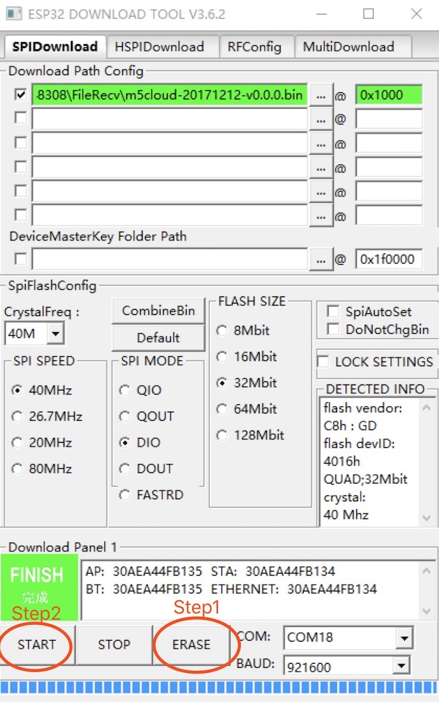
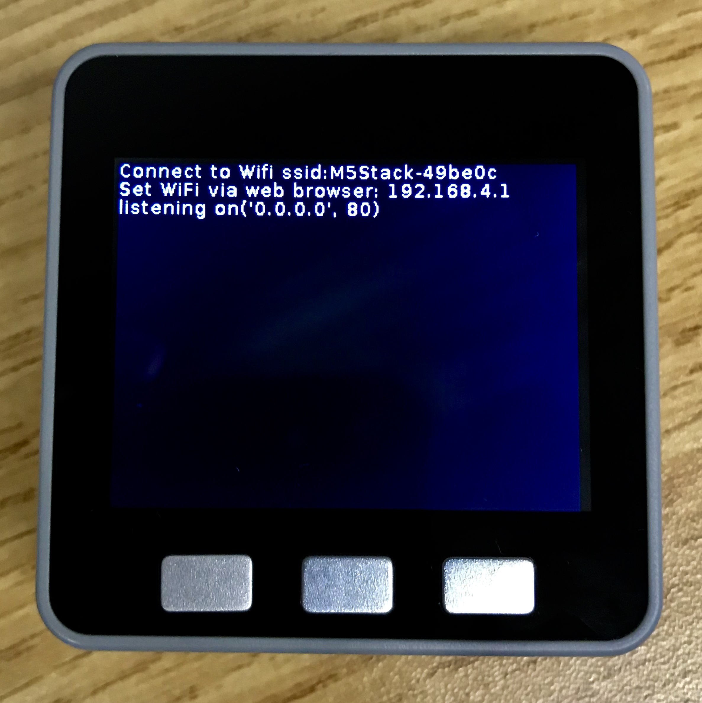
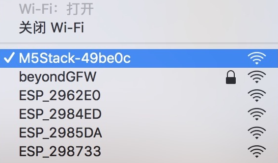
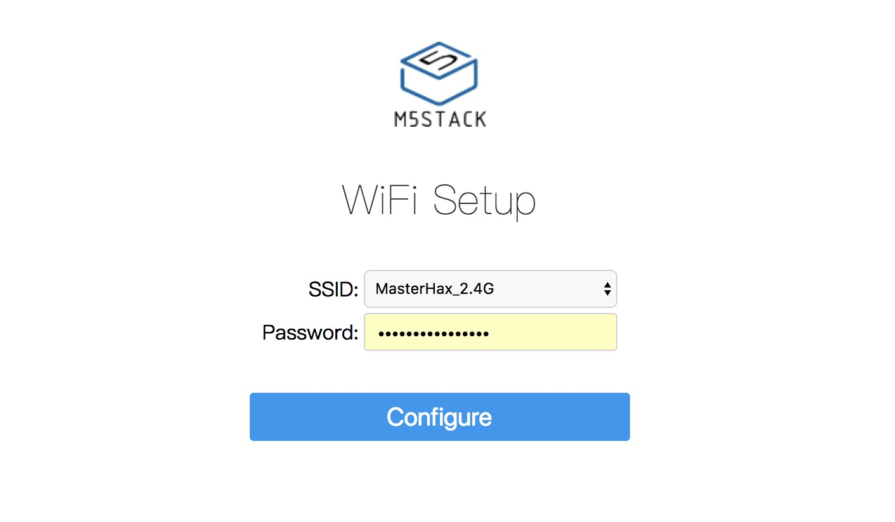
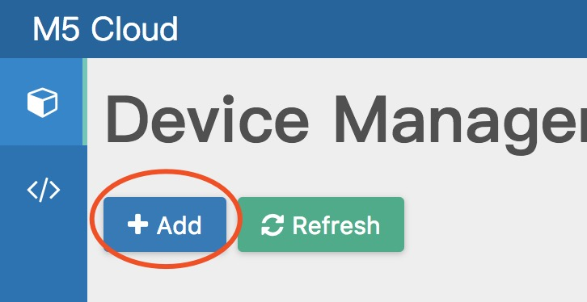
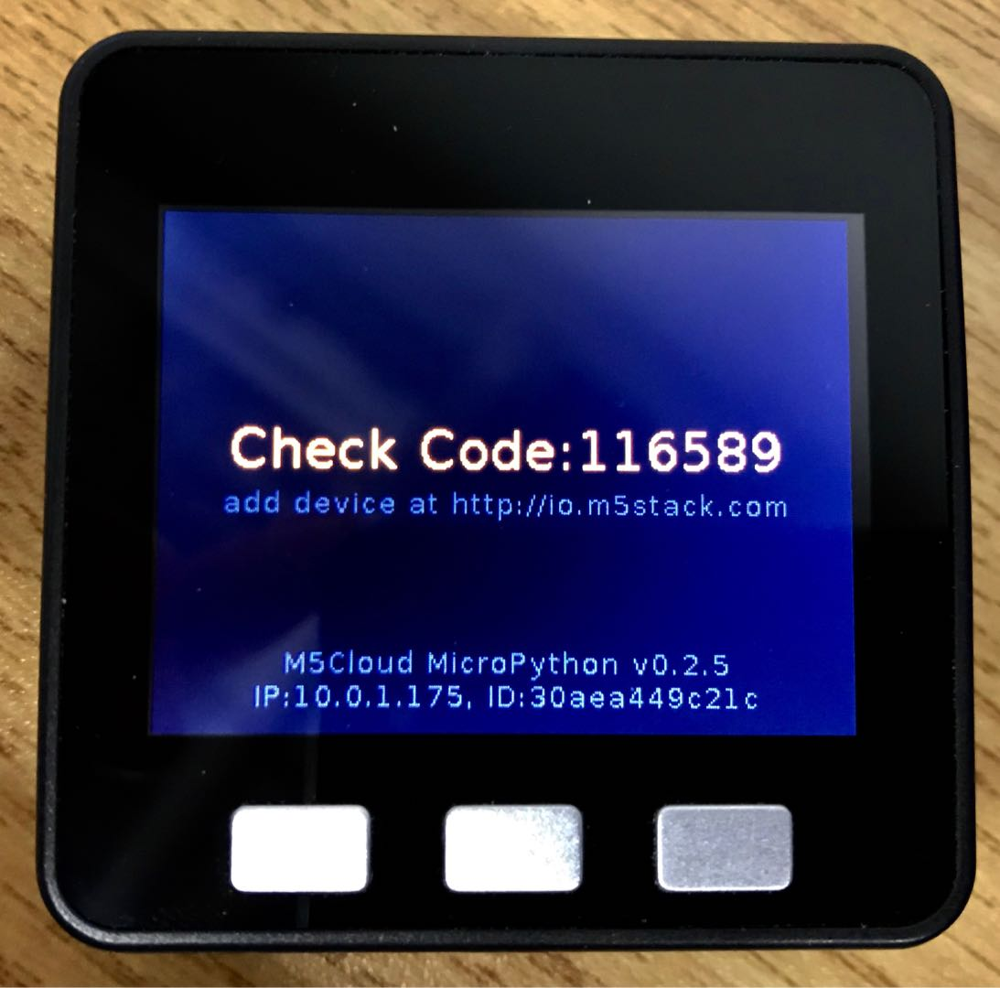
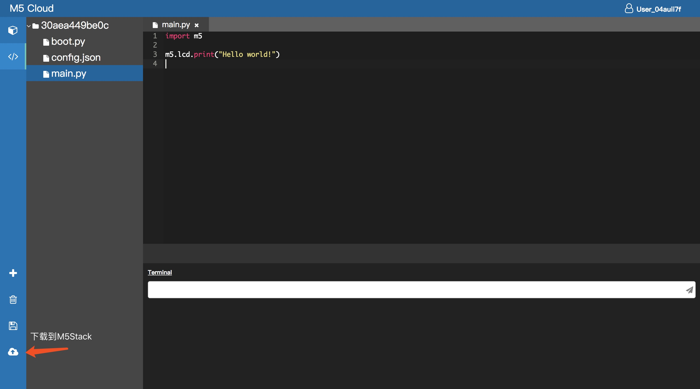

# M5Stack Web IDE

[EN](README.md) | [中文](README_CN.md)

## Getting Started

### 1. Burn firmware

#### Download firmware
[https://github.com/m5stack/M5Cloud/tree/master/firmwares](https://github.com/m5stack/M5Cloud/tree/master/firmwares)

#### MacOS/Linux
- Installing esptool：

    ```pip install esptool```
- Erase flash:
    ``` esptool.py --chip esp32 --port /dev/tty.SLAB_USBtoUART erase_flash ```
- Flash:
    ``` esptool.py --chip esp32 --port /dev/tty.SLAB_USBtoUART write_flash -z 0x1000 firmware.bin ```


#### Windows
Windows can use Espressif Flash Download Tools([Download](http://espressif.com/sites/default/files/tools/flash_download_tools_v3.6.2.2_0.rar)) (Erase first)：
   


### 2. Configure the WiFi
  - Connecting M5Stack AP:
  

    Connect the WiFi：

    
  - Use Mobile Phone or PC browser login 192.168.4.1 setting the SSID and Password.
  
  

### 3. Binding device
  Login: http://io.m5stack.com register account and add the device：

   

  Input the Check Code for the M5Stack screen display，Check Code is random,after 60s will refresh.

  
  
  


### 4. Coding


# **M5Stack** Micropython

Micropython Getting Started

## **LCD**

---

Import M5Stack:

```python
from m5stack import *
lcd.print('hello world!')
```

#### Colors

**Color** value are given as 24 bit integer numbers, 8-bit per color.

For example: **0xFF0000** represents the RED color. Only upper 6 bits of the color component value is used.

The following color constants are defined and can be used as color arguments: 

**BLACK, NAVY, DARKGREEN, DARKCYAN, MAROON, PURPLE, OLIVE, LIGHTGREY, DARKGREY, BLUE, GREEN, CYAN, RED, MAGENTA, YELLOW, WHITE, ORANGE, GREENYELLOW, PINK**

#### Drawing

All **drawings** coordinates are **relative** to the **display window**.

Initialy, the display window is set to full screen, and there are methods to set the window to the part of the full screen.

#### Fonts

9 bit-mapped fornts and one vector 7-segment font are included.
Unlimited number of fonts from file can also be used.

The following font constants are defined and can be used as font arguments: 

**FONT_Default, FONT_DefaultSmall, FONT_DejaVu18, FONT_Dejavu24, FONT_Ubuntu, FONT_Comic, FONT_Minya, FONT_Tooney, FONT_Small, FONT_7seg**


---

## Methods


### tft.pixel(x, y [,color])

Draw the pixel at position (x,y).<br>
If *color* is not given, current foreground color is used.


### tft.readPixel(x, y)

Get the pixel color value at position (x,y).


### tft.line(x, y, x1, y1 [,color])

Draw the line from point (x,y) to point (x1,y1)<br>
If *color* is not given, current foreground color is used.


### tft.lineByAngle(x, y, start, length, angle [,color])

Draw the line from point (x,y) with length *lenght* starting st distance *start* from center.<br>
If *color* is not given, current foreground color is used.<br>
The angle is given in degrees (0~359).


### tft.triangle(x, y, x1, y1, x2, y2 [,color, fillcolor])

Draw the triangel between points (x,y), (x1,y1) and (x2,y2).<br>
If *color* is not given, current foreground color is used.<br>
If *fillcolor* is given, filled triangle will be drawn.


### tft.circle(x, y, r [,color, fillcolor])

Draw the circle with center at (x,y) and radius r.<br>
If *color* is not given, current foreground color is used.<br>
If *fillcolor* is given, filled circle will be drawn.


### tft.ellipse(x, y, rx, ry [opt, color, fillcolor])

Draw the circle with center at (x,y) and radius r.<br>
If *color* is not given, current foreground color is used.<br>
**opt* argument defines the ellipse segment to be drawn, default id 15, all ellipse segments.

Multiple segments can drawn, combine (logical or) the values.
* 1 - upper left segment
* 2 - upper right segment
* 4 - lower left segment
* 8 - lower right segment

If *fillcolor* is given, filled elipse will be drawn.


### tft.arc(x, y, r, thick, start, end [color, fillcolor])

Draw the arc with center at (x,y) and radius *r*, starting at angle *start* and ending at angle *end*<br>
The thicknes of the arc outline is set by the *thick* argument<br>
If *fillcolor* is given, filled arc will be drawn.


### tft.poly(x, y, r, sides, thick, [color, fillcolor, rotate])

Draw the polygon with center at (x,y) and radius *r*, with number of sides *sides*<br>
The thicknes of the polygon outline is set by the *thick* argument<br>
If *fillcolor* is given, filled polygon will be drawn.<br>
If *rotate* is given, the polygon is rotated by the given angle (0~359)


### tft.rect(x, y, width, height, [color, fillcolor])

Draw the rectangle from the upper left point at (x,y) and width *width* and height *height*<br>
If *fillcolor* is given, filled rectangle will be drawn.


### tft.roundrect(x, y, width, height, r [color, fillcolor])

Draw the rectangle with rounded corners from the upper left point at **(x,y)** and width **width** and height **height**<br>
Corner radius is given by **r** argument.<br>
If **fillcolor** is given, filled rectangle will be drawn.


### tft.clear([color])

Clear the screen with default background color or specific color if given.


### tft.clearWin([color])

Clear the current display window with default background color or specific color if given.


### tft.orient(orient)

Set the display orientation.<br>
Use one of predifined constants:<br>**tft.PORTRAIT**, **tft.LANDSCAPE**, **tft.PORTRAIT_FLIP**, **tft.LANDSCAPE_FLIP**


### tft.font(font [,rotate, transparent, fixedwidth, dist, width, outline, color])

Set the active font and its characteristics.

| Argument | Description |
| - | - |
| font | required, use font name constant or font file name |
| rotate | optional, set font rotation angle (0~360) |
| transparent | only draw font's foreground pixels |
| fixedwidth | draw proportional font with fixed character width, max character width from the font is used |
| dist | only for 7-seg font, the distance between bars |
| width | only for 7-seg font, the width of the bar |
| outline | only for 7-seg font, draw the outline |
| color | font color, if not given the current foreground color is used |


### tft.attrib7seg(dist, width, outline, color)

Set characteristics of the 7-segment font

| Argument | Description |
| - | - |
| dist | the distance between bars |
| width | the width of the bar |
| outline | outline color |
| color | fill color |


### tft.fontSize()

Return width and height of the active font


### tft.text(x, y, text [, color])

Display the string *text* at possition (x,y).<br>
If *color* is not given, current foreground color is used.

* **x**: horizontal position of the upper left point in pixels, special values can be given:
  * CENTER, centers the text
  * RIGHT, right justifies the text
  * LASTX, continues from last X position; offset can be used: LASTX+n
* **y**: vertical position of the upper left point in pixels, special values can be given:
  * CENTER, centers the text
  * BOTTOM, bottom justifies the text
  * LASTY, continues from last Y position; offset can be used: LASTY+n
* **text**: string to be displayed. Two special characters are allowed in strings:
  * ‘\r’ CR (0x0D), clears the display to EOL
  * ‘\n’ LF (ox0A), continues to the new line, x=0

 
### tft.textWidth(text)

Return the width of the string *text* using the active font fontSize


### tft.textClear(x, y, text [, color])

Clear the the screen area used by string *text* at possition (x,y) using the bacckground color *color*.<br>
If *color* is not given, current background color is used.


### tft.image(x, y, file [,scale, type])

Display the image from the file *file* on position (x,y)
* **JPG** and **BMP** can be displayed.
* Constants **tft.CENTER**, **tft.BOTTOM**, **tft.RIGHT** can be used for x&y
* **x** and **y** values can be negative

**scale** (jpg): image scale factor: 0 to 3; if scale>0, image is scaled by factor 1/(2^scale) (1/2, 1/4 or 1/8)<br>
**scale** (bmp): image scale factor: 0 to 7; if scale>0, image is scaled by factor 1/(scale+1)<br>
**type**: optional, set the image type, constants *tft.JPG* or *tft.BMP* can be used. If not set, file extension and/or file content will be used to determine the image type.


### tft.setwin(x, y, x1, y1)

Set active display window to screen rectangle (x,y) - (x1,y1)


### tft.resetwin()

Reset active display window to full screen size.


### tft.savewin()

Save active display window dimensions.


### tft.restorewin()

Restore active display window dimensions previously saved wint savewin().


### tft.screensize()

Return the display size, (width, height)


### tft.winsize()

Return the active display window size, (width, height)


### tft.hsb2rgb(hue, saturation, brightness)

Converts the components of a color, as specified by the HSB model, to an equivalent set of values for the default RGB model.<br>
Returns 24-bit integer value suitable to be used as color argiment

Arguments
* **hue**: float: any number, the floor of this number is subtracted from it to create a fraction between 0 and 1. This fractional number is then multiplied by 360 to produce the hue angle in the HSB color model.
* **saturation**: float; 0 ~ 1.0
* **brightness**: float; 0 ~ 1.0


### tft.compileFont(file_name [,debug])

Compile the source font file (must have **.c** extension) to the binary font file (same name, **.fon** extension) which can be used as external font.<br>
If *debug=True* the information about compiled font will be printed.

You can create the **c** source file from any **tft** font using the included [ttf2c_vc2003.exe](https://github.com/loboris/MicroPython_ESP32_psRAM_LoBo/tree/master/MicroPython_BUILD/components/micropython/esp32/modules_examples/tft/font_tool/) program.
See [README](https://github.com/loboris/MicroPython_ESP32_psRAM_LoBo/tree/master/MicroPython_BUILD/components/micropython/esp32/modules_examples/tft/font_tool/README.md) for instructions.

## **Button**

---
```python
from m5stack import *

while True:    
  if BtnA.press():
    lcd.println('button_press A')
  time.sleep_ms(10)

```

Callback：


```python
from m5stack import *

def press_cb(pin):
    lcd.println('button_press A')
    print('button_press A')
    
BtnA.set_callback(press_cb)
```

## **SD Card**

---

```python
import uos

uos.mountsd()
uos.listdir('/sd')
```


## **Beep**

---

```python
from m5stack import *

beep.tone(freq=1800)
beep.tone(freq=1800, timeout=200)
```

## **GPIO**

---

```python
import machine

pinout = machine.Pin(0, machine.Pin.OUT)
pinout.value(1)

pinin = machine.Pin(2, machine.Pin.IN)
val = pinin.value()
```

## **PWM**

---

```python
import machine

pwm = machine.PWM(machine.Pin(3))
pwm.freq(5000)
pwm.duty(666)
```


## **ADC**

---
```python
import machine

adc = machine.ADC(35)
adc.read()
```


## **I2C**

---
```python
from machine import I2C

i2c = I2C(freq=400000)          # create I2C peripheral at frequency of 400kHz
                                # depending on the port, extra parameters may be required
                                # to select the peripheral and/or pins to use

i2c.scan()                      # scan for slaves, returning a list of 7-bit addresses

i2c.writeto(42, b'123')         # write 3 bytes to slave with 7-bit address 42
i2c.readfrom(42, 4)             # read 4 bytes from slave with 7-bit address 42

i2c.readfrom_mem(42, 8, 3)      # read 3 bytes from memory of slave 42,
                                #   starting at memory-address 8 in the slave
i2c.writeto_mem(42, 2, b'\x10') # write 1 byte to memory of slave 42
                                #   starting at address 2 in the slave
```


## **UART**

---
```python
from machine import UART

uart2 = UART(2, tx=17, rx=16)
uart2.init(115200, bits=8, parity=None, stop=1)
uart2.read(10)       # read 10 characters, returns a bytes object
uart2.read()         # read all available characters
uart2.readline()     # read a line
uart2.readinto(buf)  # read and store into the given buffer
uart2.write('abc')   # write the 3 characters
```

M5stack firwmre is bose on *MicroPython_ESP32_psRAM_LoBo* More docs:
https://github.com/loboris/MicroPython_ESP32_psRAM_LoBo/wiki
